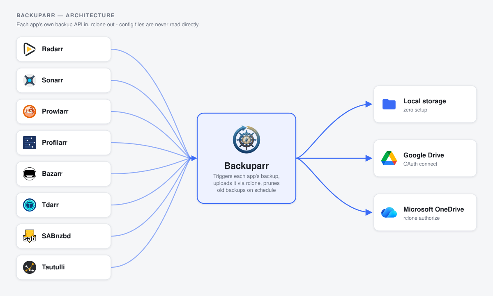

# Backuparr

**Backup your Arrs.**

> **AI disclosure:** This project was built with substantial assistance
> from Claude (Anthropic) - code, documentation, and commit history
> included. Reviewed and maintained by a human.

Scheduled config/database backups for Radarr, Sonarr, Prowlarr, Profilarr,
Bazarr, Tdarr, SABnzbd, and Tautulli (Seerr coming soon), sent to
whichever destinations you enable - Local storage, Google Drive, and
OneDrive today, with Dropbox planned. Enable more than one and every
backup gets a copy on each of them. Everything - which apps to back up,
their URLs/API keys, which destinations to use, the schedule, retention,
and restores - is configured and triggered from a web UI, not env vars.

Every app is backed up through **its own HTTP API**, never by reading its
config volume directly.

To recover after a host failure: re-create the containers from your
compose file, then restore each app's config from its latest backup (see
[Restoring after a disaster](#restoring-after-a-disaster)).

See [CHANGELOG.md](CHANGELOG.md) for release history.

## Table of contents

- [Backuparr](#backuparr)
  - [Table of contents](#table-of-contents)
  - [Architecture](#architecture)
  - [Why not reuse an existing tool?](#why-not-reuse-an-existing-tool)
  - [Per-app backup method (read this before deploying)](#per-app-backup-method-read-this-before-deploying)
    - [Profilarr backup note](#profilarr-backup-note)
    - [Tautulli backup note](#tautulli-backup-note)
    - [Bazarr auth note](#bazarr-auth-note)
    - [Tdarr auth note](#tdarr-auth-note)
  - [Environment variables](#environment-variables)
    - [Advanced: file locations](#advanced-file-locations)
  - [Destinations](#destinations)
    - [Local storage](#local-storage)
    - [Google Drive](#google-drive)
    - [OneDrive](#onedrive)
    - [Dropbox](#dropbox)
  - [Deploying](#deploying)
    - [Pull the published image (recommended)](#pull-the-published-image-recommended)
    - [Or build from source](#or-build-from-source)
    - [Login](#login)
    - [Encryption at rest](#encryption-at-rest)
  - [Restoring after a disaster](#restoring-after-a-disaster)
  - [Notifications](#notifications)
    - [Discord](#discord)
    - [Slack](#slack)
    - [Telegram](#telegram)
    - [Gotify (self-hosted)](#gotify-self-hosted)
    - [ntfy.sh, Healthchecks.io, or anything else](#ntfysh-healthchecksio-or-anything-else)
  - [Configuration reference](#configuration-reference)
  - [Credits](#credits)
  - [License](#license)

## Architecture



## Why not reuse an existing tool?

[Zerka30/servarr-backup](https://github.com/Zerka30/servarr-backup) does
this for Radarr/Sonarr/Prowlarr via S3. This tool extends the same idea
(trigger the app's own backup API, download it, upload it) to Profilarr,
Bazarr, Tdarr, and Tautulli, which have their own equivalent mechanisms,
and moves the storage side to a pick-your-destinations model built on [rclone](https://rclone.org/)
under the hood - Local out of the box, Google Drive via an in-app
"Connect" button, and OneDrive via a one-time `rclone authorize` paste,
instead of running rclone's full interactive config wizard yourself.

## Per-app backup method (read this before deploying)

| App | Method | Notes |
|---|---|---|
| Radarr / Sonarr / Prowlarr | `POST .../system/backup` to trigger, download the result, `DELETE` it server-side | Same official backup zip the apps use for manual backups. Restore is a multipart upload to `.../system/backup/restore/upload` - fully automated, no filesystem access. |
| Profilarr | `POST /api/v1/backups` to trigger (async job, polled via `GET /api/v1/jobs/{id}`), download the newest result, `DELETE` it server-side | Backup only - see the [Profilarr backup note](#profilarr-backup-note), Profilarr's own restore has no public API. |
| Bazarr | `POST /api/system/backups` to trigger, poll `GET` until the new file appears, download it, `DELETE` it server-side | The download route (`/system/backup/download/<file>`) is gated by Bazarr's own web-auth setting, **not** the API key - see the [Bazarr auth note](#bazarr-auth-note). Restore writes one local file into Bazarr's own backup folder (no upload-restore endpoint exists), then an API call triggers the restore + restart. |
| Tdarr | `POST /api/v2/cruddb` with `mode: getAll` for every internal DB collection (library settings, flows, global settings, node registrations, staged/output/statistics) | Fully API-driven both ways. Restore does `removeAll` then re-`insert`s each document per collection, one at a time (Tdarr's API has no bulk-insert mode) - destructive, asks for confirmation. |
| SABnzbd | `GET /sabnzbd/api?mode=get_config` to back up; `mode=set_config` per key to restore | SABnzbd's API returns every password field (e.g. Usenet server password) as `**********` - there's no API mode that returns the real value. Restore recreates each Usenet server (host/port/username/connections/ssl/priority/...) and every plain `misc`-style setting via the API, prompting interactively for each server's real password (an existing server's fields not included in the API call are left untouched, so a skipped password isn't overwritten with a blank one). Categories, RSS feeds, and sorters aren't auto-restored. |
| Tautulli | `GET /api/v2?cmd=download_database` and `cmd=download_config` - each streams a fresh copy directly, no trigger/poll step | The database comes back with Plex tokens nulled out; the config file is only lightly sanitized - see the [Tautulli backup note](#tautulli-backup-note). Restore uploads each back separately via `cmd=import_database` and `cmd=import_config` (multipart) - a config restore makes Tautulli restart itself. |
| Seerr | *(none)* | Not implemented - Seerr has no backup/restore API. Shown on the Settings tab as "Coming soon" for visibility only. |

### Profilarr backup note

The downloaded backup is sanitized by Profilarr itself before it leaves the
server: arr instance URLs/API keys, sync configs, notification webhook
URLs/tokens, user accounts and sessions, personal access tokens for linked
databases, and AI/TMDB API keys are all stripped. Restoring on a different
host means re-adding those by hand.

Restore isn't automated here - Profilarr's own restore action is a
browser-session-only form, not part of its `/api/v1` REST API, and even
then it only stages a pending restore; the actual swap happens at the
next Profilarr container restart. Profilarr won't show up on the
**Restore** tab. To restore by hand:

1. Download the backup from Backuparr's **History** tab.
2. Upload it in Profilarr's own **Settings > Backups** and restore it there.
3. Restart the Profilarr container and re-add whatever was stripped above.

### Tautulli backup note

`download_database` nulls out Plex user/server tokens server-side before
streaming the file back. `download_config` only strips
`PMS_TOKEN`/`JWT_SECRET` - **the Tautulli API key itself, and any
notification agent credentials stored in config.ini (webhook URLs,
tokens, etc.), come through in the backup in plain text.**

`config.json`'s secrets are encrypted at rest (see [Encryption at
rest](#encryption-at-rest)) - treat wherever your Tautulli backups land
(local disk, Google Drive, OneDrive) as holding a live, usable Tautulli
API key, and rotate it in Tautulli's own Settings if that destination is
ever compromised.

### Bazarr auth note

Bazarr's `/system/backup/download/...` route checks **Settings > General >
Security**, not your API key:
- `None` - works out of the box.
- `Basic` - fill in the "Basic auth username/password" fields on Bazarr's
  card in the web UI.
- `Forms` - not supported for automated download; switch to `None` or
  `Basic`, or put auth at your reverse proxy instead.

### Tdarr auth note

If you've enabled an API auth token in Tdarr's server settings, put it in
the (optional) API key field on Tdarr's card - it's sent as `Authorization:
Bearer <key>`. Verify it works for your version with the "Test connection"
button; leave it blank if Tdarr has no auth configured (the default).

## Environment variables

Everything app-level - which apps to back up, their URLs/API keys,
destinations, schedule, retention, restores - is set from the web UI and
lives in `config.json` (see [Configuration
reference](#configuration-reference) above), not env vars. The ones below
are the deployment-level settings that exist outside it, set in
`docker-compose.yml`'s `environment:` block.

| Env var | Default | Purpose |
|---|---|---|
| `WEBUI_PORT` | `8990` | Port the web UI listens on inside the container |
| `PUID` / `PGID` | `1000` / `1000` | User/group the container runs as instead of root - match your host user (`id`) if you want files on `./data` owned by yourself; re-applied on every start |
| `TZ` | UTC (Alpine default) | Standard timezone env var - determines what local time the cron schedule (the Daily/Weekly/Every-few-hours time picker on Settings) actually fires at, and the timestamps in `backup.log` |
| `LOG_LEVEL` | `INFO` | Python logging level for backup/restore runs - e.g. `DEBUG` for more detail while troubleshooting a connector |
| `BACKUPARR_SECRETS_KEY` | *(auto-generated)* | Overrides the auto-generated `secrets.key` value used to encrypt `config.json`'s secrets (see [Encryption at rest](#encryption-at-rest)) - set this to keep the key off the volume entirely, e.g. a Docker secret |
| `RCLONE_CONFIG_PASS` | *(auto-generated)* | Overrides the auto-generated password used to encrypt `rclone.conf` |
| `BACKUPARR_FORCE_HTTPS` | `false` | Set to `true` to mark the session cookie `Secure` (HTTPS-only) - only if Backuparr sits behind your own TLS-terminating reverse proxy. Leave unset for the default plain-HTTP-on-LAN deployment, or login will silently fail. |

### Advanced: file locations

Only relevant if you're remapping the volume layout away from the default
single `./data:/config/backuparr` mount - every path below already lives
inside that one mount by default, so most deployments never need these.

| Env var | Default | What it is |
|---|---|---|
| `BACKUPARR_CONFIG` | `/config/backuparr/config.json` | The main config file |
| `RCLONE_CONFIG` | `/config/backuparr/rclone.conf` | rclone's own remotes config |
| `RCLONE_CONFIG_PASS_FILE` | `/config/backuparr/rclone.pass` | Where the auto-generated `rclone.conf` encryption password is stored (ignored if `RCLONE_CONFIG_PASS` is set directly) |
| `BACKUPARR_SECRETS_KEY_PATH` | `/config/backuparr/secrets.key` | Where the auto-generated config-encryption key is stored (ignored if `BACKUPARR_SECRETS_KEY` is set directly) |
| `BACKUPARR_SECRET_KEY_PATH` | `/config/backuparr/secret_key` | Flask's session-signing key file - **not** the same file as `secrets.key` above (this one signs login sessions; that one encrypts config.json's secret fields) |
| `BACKUPARR_AUTH` | `/config/backuparr/auth.json` | The admin username/password hash created by the setup screen |
| `BACKUPARR_LOG_DIR` | `/var/log/backuparr` | Where `backup.log` (shown on the Run & Status tab) is written |

## Destinations

Every backup is sent to whichever destinations you enable on the
**Settings** tab - enable more than one and each run uploads to all of
them.

### Local storage

Works with zero setup. Backups land in `/config/backuparr/backups` inside
the container, on the same `./data` volume as `config.json`, so they
survive container recreation without any extra mount. Download or delete
any of them from the **History** tab. Set a custom path on the Local card
in Settings to point it at a different mounted volume (e.g. a NAS share).

### Google Drive

Connected entirely from the web UI - no `rclone config`, no files to copy
onto the host. On the Google Drive card in **Settings**:

1. Click **Setup guide** - it walks through creating a Google Cloud
   project, enabling the Drive API, and creating an OAuth client, and
   shows the exact redirect URI to register.
2. Paste the Client ID and Client Secret it gives you into the two fields,
   then **Save settings**.
3. Click **Connect Google Drive** and approve the consent screen -
   Backuparr requests only the `drive.file` scope (files/folders it
   created or you explicitly picked, not your whole Drive).
4. Click **Choose folder** to pick (or create) the Drive folder backups
   should go in.

### OneDrive

Uses rclone's own built-in Microsoft app - no Azure account or app
registration needed. Personal Microsoft accounts only, not work/school
(Microsoft 365) ones.

1. On any computer with a web browser (doesn't need to be wherever
   Backuparr runs) - [download rclone](https://rclone.org/downloads/) (a
   single binary, no install) and run `rclone authorize onedrive`.
2. It opens/prints a link - sign in with your personal Microsoft account
   and approve access.
3. Copy the block rclone prints starting with "Paste the following into
   your remote machine --->" and paste it into the OneDrive card in
   **Settings**, then click **Connect OneDrive**.

There's no folder picker: backups go to a single dedicated app folder
(`Apps/Backuparr` in your OneDrive), created automatically on first
connect.

### Dropbox

Shown on the Settings tab as "Coming soon" - not wired up yet.

## Deploying

Add a `backuparr` service to your **existing** compose file (the one that
already defines radarr/sonarr/etc.) so it shares that stack's network and
can reach the other containers by name.

### Pull the published image (recommended)

```yaml
services:
  backuparr:
    image: rsaturns/backuparr:latest
    container_name: backuparr
    restart: unless-stopped
    environment:
      - TZ=America/Los_Angeles
      - PUID=1000
      - PGID=1000
    ports:
      - "8990:8990"
    volumes:
      # config.json, rclone.conf, and local-destination backups.
      - /share/Container/backuparr:/config/backuparr
      # Optional: needed only to restore Bazarr - path to its config/backup folder.
      #- /share/Container/bazarr/backup:/mnt/bazarr-backup
```

```sh
docker compose up -d
```

Or without Compose:

```sh
docker run -d --name backuparr --restart unless-stopped \
  -e TZ=America/Los_Angeles -e PUID=1000 -e PGID=1000 \
  -p 8990:8990 \
  -v /share/Container/backuparr:/config/backuparr \
  rsaturns/backuparr:latest
```

Published for both `linux/amd64` and `linux/arm64`. `latest` tracks the
most recent commit to `main`; pin a specific version instead (e.g.
`rsaturns/backuparr:0.9.0-beta`) if you'd rather control upgrades
yourself - see [Docker Hub](https://hub.docker.com/r/rsaturns/backuparr)
for available tags.

### Or build from source

Clone this repo, then use its own `docker-compose.yml` (swap the `image:`
line above for `build: .`) instead:

```sh
docker compose up -d --build backuparr
```

Then open `http://<host>:8990` - the first visit is a one-time setup
screen to create an admin username/password; every visit after that
requires logging in. On the **Settings** tab:

1. For each app you want backed up: flip it on, fill in its URL (container
   name + internal port if it's on the same Compose network, e.g.
   `http://radarr:7878` - or a LAN IP:port for anything on host networking,
   like Tdarr) and API key (from that app's Settings > General), then hit
   **Test connection** to confirm it's right before saving.
2. Enable at least one destination - Local needs nothing further; see
   [Destinations](#destinations) above for connecting Google Drive or
   OneDrive.
3. Set retention and a backup schedule (Daily/Weekly/Every few hours, with
   a time picker) - or expand **Advanced** to enter a raw cron expression
   instead.
4. **Save settings.**

Everything is written to `config.json` on the `./data` volume, so it
survives container recreation - the cron schedule inside the container
picks up changes automatically the next time you save, no restart needed.

Use the **Run & Status** tab to trigger a backup immediately and watch it
happen live, **History** to see what's on each destination per app (and
download or delete any backup from there), and **Restore** for disaster
recovery (see below).

### Login

The setup screen's admin account is required by default. Forgot the
password? Click **Reset Backuparr** on the login screen - after
confirming a warning and typing a confirmation phrase, it wipes local
state (every app's API key, both destinations' connections, this admin
account, and local backup files - anything already uploaded to Google
Drive/OneDrive is untouched) back to a fresh install and shows the setup
screen again.

**The reset endpoint is reachable without logging in**, gated only by a
fixed confirmation phrase visible in this project's source
(`webui/static/login.js`), not a per-install secret. This is fine on a
trusted LAN behind your own firewall, but **do not expose port 8990 to an
untrusted network** without putting a login of your own in front of it at
the reverse-proxy layer.

This only authenticates the app itself - if it's reachable beyond your own
LAN, put it behind your own reverse proxy for TLS the same way you likely
already do for Radarr/Sonarr.

### Encryption at rest

Every app's API key, Bazarr's basic-auth password, Google Drive's client
secret/refresh token, and OneDrive's token are encrypted in `config.json`.
The key lives in its own file, `secrets.key`, auto-generated on first run;
override it with the `BACKUPARR_SECRETS_KEY` env var to keep the key off
the volume entirely (e.g. a Docker secret).

`rclone.conf` (which mirrors the same Google Drive/OneDrive secrets for
rclone's own use) is encrypted too, using rclone's own built-in config
encryption. Same pattern: an auto-generated password in its own file,
`rclone.pass`, overridable with `RCLONE_CONFIG_PASS` directly.

Encryption is on unconditionally - nothing to enable.

## Restoring after a disaster

Re-create the app containers from your compose file first (config volumes
will be empty/fresh), then use the **Restore** tab: pick the source,
pick the app, pick a backup (newest first), and confirm. Like a backup
run, the restore shows live progress and a log instead of just blocking
on a spinner.

Every restorable app also has a **"Restore to a different target"**
checkbox, which lets you override just that app's URL/API key (and any
extra fields it has, e.g. Bazarr's Basic auth username/password) for this
one restore only - nothing is written back to Settings. Useful for
restoring onto a rebuilt or renamed instance, or for testing a restore
against a throwaway copy before trusting it against the real thing.

- **Radarr/Sonarr/Prowlarr** - fully automated, the app restarts itself.
- **Profilarr** - not available here; see the [Profilarr backup
  note](#profilarr-backup-note) above for the manual restore steps.
- **Bazarr** - needs a local path to its own config/backup folder; fill in
  the "Bazarr backup folder" field if you didn't already set
  `bazarr_backup_dir` in Settings (this needs that path mounted into the
  backuparr container, see the commented-out volume in `docker-compose.yml`).
- **Tdarr** - destructive (wipes each DB collection before repopulating) -
  the UI warns about this before you confirm.
- **SABnzbd** - picking a backup file auto-loads its Usenet server list, showing
  which ones need a password (SABnzbd's API never returns the real value -
  see the table above); type them in, then restore. Leave any blank to set
  that server's password manually in SABnzbd's Settings afterward instead.
- **Tautulli** - restores the database and config separately; Tautulli
  restarts itself once the config half is applied.

## Notifications

Set **Notify URL** on the Settings tab (`notify_url` in config.json) to
get a summary POSTed there after every run - one line per app (✅/❌),
under a 🎉 header if everything succeeded or a ⚠️ header if anything
failed. Paste one URL and Backuparr sends the right kind of request
automatically - it recognizes a few common webhook shapes by the URL
itself.

### Discord

1. In the target channel: **Edit Channel > Integrations > Webhooks > New
   Webhook**, then **Copy Webhook URL**.
2. Paste that straight into **Notify URL**.

### Slack

1. Create an [incoming
   webhook](https://api.slack.com/messaging/webhooks) for your
   workspace and channel.
2. Paste the resulting `https://hooks.slack.com/services/...` URL into
   **Notify URL**.

### Telegram

1. Message [@BotFather](https://t.me/BotFather) to create a bot; it
   gives you a token.
2. Get your chat ID: message your new bot once, then visit
   `https://api.telegram.org/bot<TOKEN>/getUpdates` in a browser and
   read `chat.id` from the JSON (for a group, add the bot to the group
   first and use the group's chat ID instead, which is negative).
3. Set **Notify URL** to:
   ```
   https://api.telegram.org/bot<TOKEN>/sendMessage?chat_id=<CHAT_ID>
   ```

### Gotify (self-hosted)

1. In Gotify, create an application under **Apps** and copy its token.
2. Set **Notify URL** to:
   ```
   https://<your-gotify-host>/message?token=<APP_TOKEN>
   ```

### ntfy.sh, Healthchecks.io, or anything else

Any URL that doesn't match one of the shapes above gets the message sent
as a plain-text `POST` body instead - [ntfy.sh](https://ntfy.sh)'s own
native format. **Notify URL**: `https://ntfy.sh/your-topic-name` (a
self-hosted ntfy server works the same way). Also works with a
[healthchecks.io](https://healthchecks.io)-style ping URL, an Uptime Kuma
push URL, or any simple webhook logger that just wants the raw text.

## Configuration reference

Everything below lives in `config.json` (edited via the web UI, or by hand
if you'd rather):

| Field | Purpose |
|---|---|
| `apps.<name>.enabled/url/api_key` | Per app, as shown in the Settings tab |
| `apps.bazarr.username/password` | Only if Bazarr's web auth is set to `Basic` |
| `destinations.local.enabled/path` | Local storage - path defaults to `/config/backuparr/backups` if blank |
| `destinations.gdrive.enabled/client_id/client_secret` | Google Drive OAuth client, set via the Setup guide |
| `destinations.gdrive.refresh_token/folder_id/folder_name` | Set automatically by the Connect/Choose folder buttons - don't hand-edit |
| `destinations.onedrive.enabled` | Whether the destination is active |
| `destinations.onedrive.token/drive_id/drive_type/item_id` | Set automatically by pasting a token from `rclone authorize onedrive` - don't hand-edit |
| `retention_days` | Delete backups older than this, per app per destination (default 7) |
| `cron_schedule` | Standard 5-field cron syntax (default `0 3 * * *`) |
| `notify_url` | Optional: POST a summary here after every run - see [Notifications](#notifications) above |
| `bazarr_backup_dir` | Local path to Bazarr's config/backup folder, for restores |

A few deployment-level settings live outside `config.json` entirely, as
env vars in `docker-compose.yml` - see [Environment
variables](#environment-variables) above.

## Credits

App icons (`webui/static/icons/`) are from the [selfh.st icon
collection](https://selfh.st/icons/) ([selfhst/icons on
GitHub](https://github.com/selfhst/icons)), licensed
[CC BY 4.0](https://github.com/selfhst/icons/blob/main/LICENSE).

## License

[GNU AGPLv3](LICENSE) - if you run a modified version of this as a
network service, that modified source needs to be available to its
users too.
